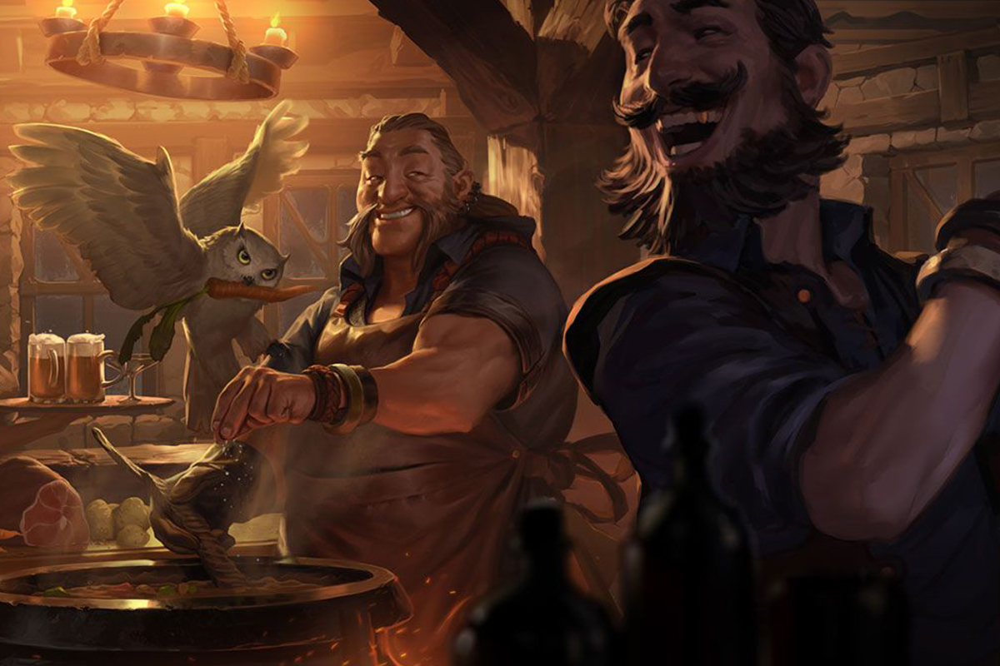

# Tha Frostfire Tavernkeeper Bot

Welcome Fella! Here you could find the quest inkeeper bot for [VulcanVerse](https://vulcanforged.com/) community.
If you are unkwnown with the project. Feel free to join the [Discord Server](https://discord.com/invite/ZyjTvFM) and get informed. You will need to belong to the discord to make use of the bot.
Finally if you are new to the game and are looking to create an account you can do it from [here](https://auth.vulcanforged.com/Account/Login?referrallink=7TLFM0W8XG80VNSZ)

## How does the bot work?

The bot is a simple machine. It shows you a list of available quests loaded from the *resources* folder following the JSON format you can found. If you wonder how to add a quest, copy any of the JSON files under the *resources/quests* folder and use it has a base.

The JSON format allows this values for **Quests**:
| key |  type  | value |
| --- |  ----- | ----- |
| title |  string | Title of the Quest |
| description |  string | Short description for the selector meny |
| allowSkip |  boolean | Allow the use of !skip for this quest |
| emojiMenu |  string | Emoji for the menu |
| emojiId |  string | Emoji id for the menu |
| enableSuccessMessages |  boolean | true to show success messages to be shown after a valid answer |
| enableFailureMessages |  boolean | true to show failure messages to be shown after a unvalid answer |
| delayBetweenAnswers |  number | Delay between user answers in ms |
| interactions |  Interactions | List of interactions. Find the allowed values below |

The JSON format allows this values for **Interactions**:
| key |  type  | value |
| --- |  ----- | ----- |
| message |  string | Interaction message |
| possibleAnswers |  [string] | List of possible answers |
| imgs |  [string] | List of image urls to send with the interaction |
| hints |  [string] | List of possible hints to be shown with !hint |
| requireAnswer |  boolean | True if the interaction requires an answer |
| customSuccessTexts |  string | List of custom success texts for this interaction |
| customFailureTexts |  string | List of custom failure texts for this interaction |